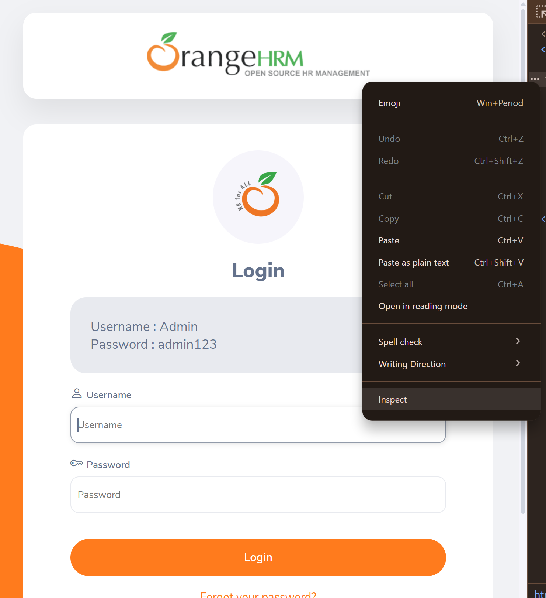
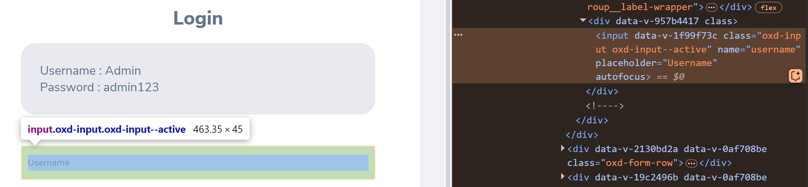

# Introduction
This is a simple automated testing of a open-source website designed for allowing other programmers such as myself to test QA automation using Selenium and Pytest. The website can be found here: 

https://opensource-demo.orangehrmlive.com/
# Pre-requisites
- Windows Subsystem for Linux 2 with Ubuntu Distribution
- Windows 11
- VSCode
- VSCode WSL Remote Extension

Could probably work on any Linux Distro but we are using WSL2.

# First time WSL Set-up
```
wsl install
``` 
# Install Latest Ubuntu
```
wsl --install ubuntu
```
# Get Ubuntu Updates
```
sudo apt update
```
# Get Full Python
```
sudo apt install python3-full
```
# Get pip
```
sudo apt install python3-pip
```
# Create Virtual Environment
```
python3 -m venv qa_automate
```
# Get Chrome Driver for Selenium and Pytest
```
sudo apt install chromium-chromedriver
```

# Get Packages for Environment
Note: `sudo` and `--break-system-packages` are crucial to allow pip packages to be installed inside the environment. Otherwise it defaults to installing GLOBALLY.

```
source qa_automate/bin/activate 
```
```
sudo pip install selenium pytest --break-system-packages

```
# To Run Automation Tests
Note: cmd should be run in this folder where this README is.
```
pytest -v
```
# Additional Notes
To use pytest, you test python scripts MUST have `test_` in front of them, for eg. `test_login.py`.

For selenium, using `wait` is a very good idea because the `driver` is often faster than the page load time, hence it would be unable to find the element. 
In this case I asked it to `wait` for 15 seconds, `until` it manages to find the element. If not, it will fail the test.

```python
wait = WebDriverWait(driver, 15)

# Wait until the username input is present
username = wait.until(EC.visibility_of_element_located((By.NAME, "username")))
```
Conveniently Browsers have an Inspect Tool, allowing us to find the name of elements on the webpage and test them.


Here is how one might find a element name:



# Future Improvements
1. A way to automate set-up. 
2. Debug Virtual Environments on Ubuntu in WSL and find out why it keeps throwing error about externally managed environments.
3. Add More Tests 

# References
## Selenium
https://www.selenium.dev/documentation/webdriver/elements/finders/